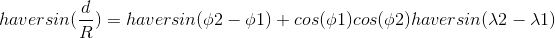

# haversine

haversine is a Go library which implements the haversine formula.



## Reference

[Haversine formula - Wikipedia](https://en.wikipedia.org/wiki/Haversine_formula)

[半正矢公式 - 维基百科，自由的百科全书](https://zh.wikipedia.org/zh-hans/Haversine_formula)

## USAGE

```
package main

import (
	"fmt"

	"github.com/cloudfstrife/haversine"
)

func main() {
	point1 := haversine.Point{Latitude: 22.54587746, Longitude: 114.12873077}
	point2 := haversine.Point{Latitude: 23.0, Longitude: 115.0}

	distance := haversine.Distance(point1, point2)
	fmt.Println(distance)
}
```